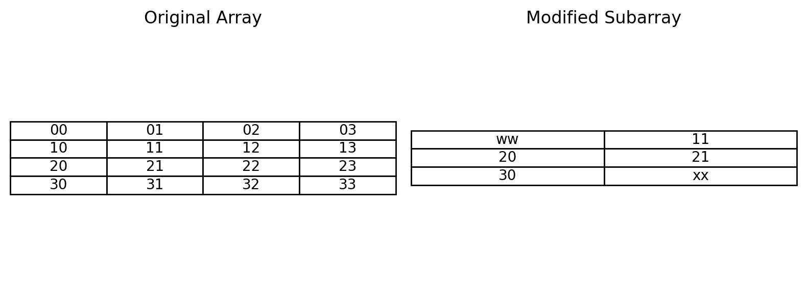

# Subarray Extraction and Modification Showcase

This project demonstrates how to extract a subarray from a NumPy array as an **independent copy** so that changes to the subarray do **not** affect the original array.

## Features
- Extracts a subarray from a 2D NumPy array.
- Demonstrates that the extracted subarray is **independent** of the original.
- Modifies specific elements in the subarray without altering the source array.
- Prints both arrays before and after modification for clarity.

## How It Works
1. A **4x4** NumPy array is created with labeled string elements.
2. A **3x2** subarray is extracted starting at row index 1 and column index 0 using array slicing.
3. The extracted subarray is explicitly copied into a new NumPy array to ensure independence.
4. Specific elements in the subarray are modified, and the original array is shown unchanged.

## Example Output
```lua
Original Array:
[['00' '01' '02' '03']
['10' '11' '12' '13']
['20' '21' '22' '23']
['30' '31' '32' '33']]

Extracted Subarray:
[['10' '11']
['20' '21']
['30' '31']]

Modified Subarray:
[['ww' '11']
['20' '21']
['30' 'xx']]

Original Array After Modification Attempt:
[['00' '01' '02' '03']
['10' '11' '12' '13']
['20' '21' '22' '23']
['30' '31' '32' '33']]
```

## Output


## Requirements
- Python 3.x
- NumPy

## How to Run
```bash
pip install numpy
python subarray_extraction.py
```
